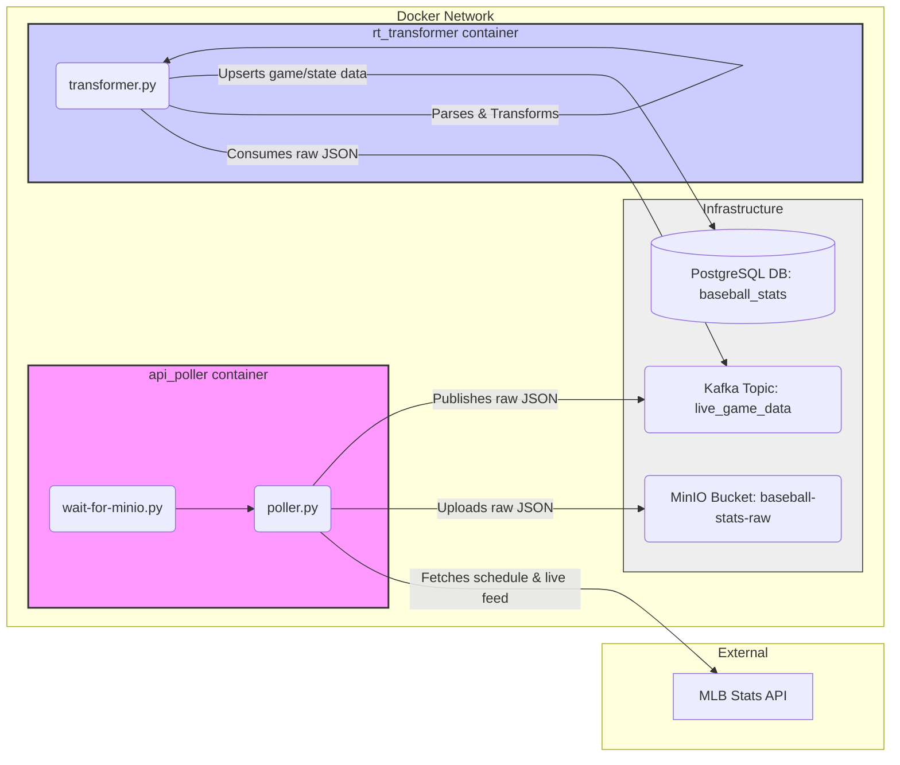

# Baseball Stats Pipeline: Ingestion Services

This document explains the core data ingestion components (`api_poller` and `rt_transformer`) and the overall data flow for getting real-time baseball stats into the system.

## Project Directory Structure

The relevant directories for ingestion are:

```
baseball_stats_pipeline/
├── api_poller/           # Service to fetch data from MLB API
│   ├── Dockerfile        # Defines the Docker image for the poller
│   ├── entrypoint.sh     # Script run when container starts (waits for MinIO, runs poller)
│   ├── poller.py         # Main script for fetching, uploading to MinIO, sending to Kafka
│   ├── requirements.txt  # Python dependencies for the poller
│   ├── wait-for-minio.py # Utility script to ensure MinIO is ready
│   └── tests/            # Unit and integration tests for the poller
│       ├── test_poller.py
│       └── test_poller_main.py
├── rt_transformer/       # Service to process data from Kafka and load to DB
│   ├── Dockerfile        # Defines the Docker image for the transformer
│   ├── transformer.py    # Main script for consuming Kafka, transforming, loading to DB
│   ├── requirements.txt  # Python dependencies for the transformer
│   └── tests/            # Unit tests for the transformer
│       └── test_transformer.py
├── docker-compose.yml    # Defines all services (infra + apps) and how they connect
└── ... (other components like api_service, airflow_dags)
```

## Data Flow Diagram (Mermaid)



## Component Details

### 1. API Poller (`api_poller`)

*   **Purpose:** Acts as the primary interface to the external MLB Stats API. It fetches data and dispatches it to the internal systems (MinIO and Kafka).
*   **Execution:**
    *   Runs inside a Docker container defined by `api_poller/Dockerfile`.
    *   The `entrypoint.sh` script first runs `wait-for-minio.py` to ensure the MinIO service is available.
    *   Then, `poller.py` is executed.
*   **Modes:**
    *   **Live Mode (Default):** Periodically checks the MLB schedule API for games currently marked "Live". For each live game, it fetches the detailed live feed data (`/feed/live`).
    *   **Backfill Mode (using `--backfill-days N`):** Fetches the schedule for the specified past `N` days, gets the `gamePk` for *all* games in that range (regardless of status), fetches the feed data for each game once, and then exits.
*   **Outputs:**
    *   **MinIO (Data Lake):** Uploads the raw JSON feed data for *every* fetched game to the `baseball-stats-raw` bucket. The data is partitioned using the following structure:
        ```
        <bucket_name>/<season>/<game_type>/<status>/<game_pk>/<timestamp>.json
        ```
        *   `season`: e.g., `2024`
        *   `game_type`: e.g., `regular`, `spring`, `wildcard`
        *   `status`: e.g., `live`, `final`, `preview` (lowercase)
        *   `game_pk`: The unique ID for the game (e.g., `745804`)
        *   `timestamp`: The timestamp from the API metadata or generated timestamp (e.g., `20240329_220000.json`)
    *   **Kafka:** Publishes the same raw JSON feed data to the `live_game_data` topic. The `gamePk` is used as the Kafka message key for potential partitioning or keyed consumption.

### 2. Real-time Transformer (`rt_transformer`)

*   **Purpose:** Consumes the raw data stream from Kafka, performs necessary transformations, and loads key real-time information into the structured PostgreSQL database.
*   **Execution:**
    *   Runs inside a Docker container defined by `rt_transformer/Dockerfile`.
    *   The `transformer.py` script starts upon container launch.
*   **Inputs:**
    *   Consumes messages from the `live_game_data` Kafka topic. It belongs to the `rt_transformer_group` consumer group and commits offsets manually after processing each message.
*   **Processing:**
    *   Deserializes the JSON message from Kafka.
    *   Extracts key information about the game (teams, venue, status, datetime) and its current state (inning, score, outs, balls, strikes, runners, current batter/pitcher).
    *   Connects to the PostgreSQL database (`baseball_stats`).
*   **Outputs (Database):**
    *   Performs an **UPSERT** (INSERT or UPDATE on conflict) into the `games` table using `game_pk` as the key.
    *   Performs an **UPSERT** into the `game_state` table using `game_pk` as the key, overwriting the previous state for that game with the latest information from the message.

## Summary

The `api_poller` fetches raw data and stores it durably in MinIO while also sending it to Kafka for real-time processing. The `rt_transformer` listens to Kafka and updates the PostgreSQL database with the latest game state information, making it available for querying by downstream services like the `api_service`.
